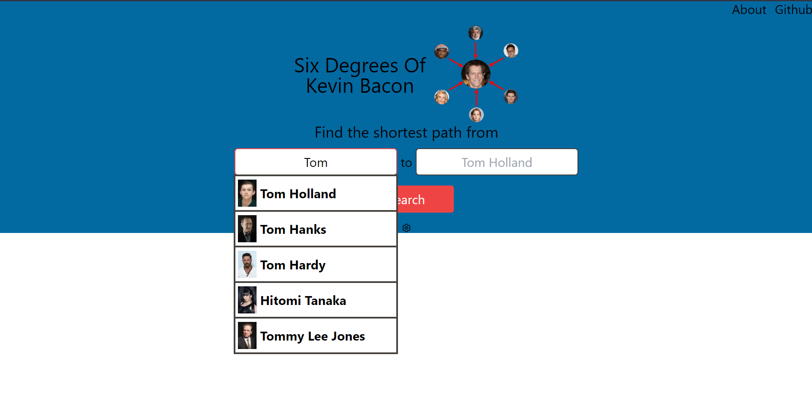
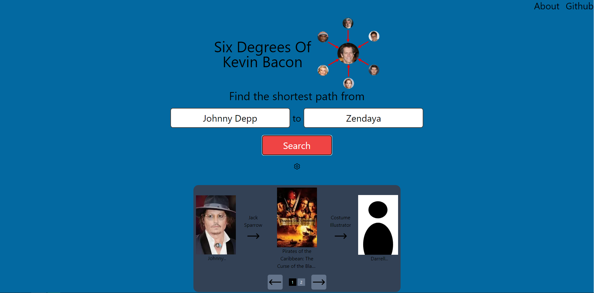
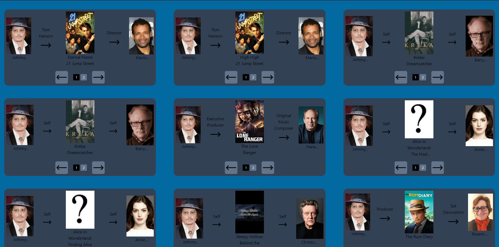

# Six Degrees of Kevin Bacon

## Sean Firsching

### Undergraduate Computer Science Capstone

### Capstone Advisor: Dr. Reale

### SUNY Polytechnic Institute

### Spring 2023

## Introduction

The project aimed to build a website that would allow users to find a connection between two Hollywood personalities by analyzing their previous collaborations on various projects. The website was built using Next.js and React, with a Neo4j database that was populated with data collected using a Python API. The concept of Six Degrees of Kevin Bacon inspired the project. The website's core functionality is to find the shortest path connecting two Hollywood stars by analyzing their previous collaborations.

The project faced several challenges that needed to be overcome. One of the primary challenges was collecting the data required to build the Neo4j database. The data was collected using a Python and an API from TMDB, which required significant effort to set up and configure correctly. Additionally, the data had to be cleaned and processed before it could be loaded into the database, which required additional effort and time.

Another significant challenge was building the website's front-end and back-end components using Next.js and React. Developing a user-friendly and visually appealing website that could effectively handle the complexity of querying the Neo4j database was challenging. The website needed to provide an intuitive user interface that allowed users to enter the names of two Hollywood stars and receive the shortest path connecting them.

Lastly, the project also had to deal with the challenge of optimizing the database queries to ensure efficient and speedy results. Querying a large database with a complex schema can be time-consuming, and then I had to work on optimizing the queries to ensure the website's performance was not negatively impacted.

## Related work 

The concept of Six Degrees of Kevin Bacon was inspired by the idea of six degrees of separation, which posits that any two people on Earth are six or fewer acquaintance links apart [1]. The game challenges players to find the shortest path between a given actor and Kevin Bacon, using only their co-stars in movies as intermediate links [2]. The game was invented in 1994 by three Albright College students, who wrote a letter to Jon Stewart and appeared on his show to explain the game [1]. The game became popular and was referenced in various media outlets and parodied by Kevin Bacon himself [2]. The game also sparked interest in graph theory and computer science, as finding the shortest path between two actors can be modeled as a graph problem [3]. 

Another reference for the related work section is a website called Six Degrees of Wikipedia. This website lets users find the shortest path between any two Wikipedia articles by using the links that connect them. It is like the Six Degrees of Kevin Bacon game, but it uses Wikipedia instead of actors [4].  This website is also influenced by the idea of Wikipedia speed running, which is a game where players try to navigate from one Wikipedia article to another as fast as possible using only the article links [5]. Wikipedia speed running is a form of speed running, which is the act of playing a video game or a section of a video game with the goal of completing it as fast as possible [6]. 

## Method 

### Data 

#### Collecting the Data

The data was collected using a Python API from TMDB. The API was used to collect data about movies and actors. The request for the data was done asynchronously using the asyncio library. The data was collected using a Python API from TMDB. The API was used to collect data about movies and actors. The request for the data was done asynchronously using the asyncio library. This sped up the process of collecting the data, as it allowed the program to make multiple requests at the same time.

#### Cleaning and Processing the Data

The data had issue with some dates being in the wrong format. This was fixed by using the datetime library to convert the dates to the correct format. The data also had boolean values with the first letter capitalized and this was fixed by converting the values to lowercase. The data also had some missing values, which were replaced with the string "None". The data was also converted to JSON format and saved to a file. This was done to make it easier to load the data into the Neo4j database.

#### Loading the Data into the Database

The data was loaded into the Neo4j database using the admin console. The data was split into csv files that contained the data and another that was the header that had the value titles and their types. The command to load the data was:

``` Cypher

neo4j-admin database import full --nodes=import/movies_header.csv,import/movies.csv --nodes=import/tv_episodes_header.csv,import/tv_episodes.csv --nodes=import/tv_shows_header.csv,import/tv_shows.csv --nodes=import/people_header.csv,import/people.csv --relationships=import/crew_movies_header.csv,import/crew_movies.csv --relationships=import/cast_movies_header.csv,import/cast_movies.csv --relationships=import/tv_cast_header.csv,import/tv_cast.csv --relationships=import/tv_crew_header.csv,import/tv_crew.csv --overwrite-destination --ignore-extra-columns=true --skip-duplicate-nodes --skip-bad-relationships --id-type=integer. This command points to each of the files and whether they are a node or a relationship. It also handles any errors that may occur. 
```

Following loading the data a few other commands had to be ran. One of them was

``` Cypher
CALL apoc.periodic.iterate(
'MATCH (p:Person) RETURN p',
'SET p.lowercase_name = toLower(p.name)',
{batchSize:10000, parallel:True}) YIELD batches, total
RETURN batches, total;
```

which would set the lowercase_name property for each person. This was done to make it easier to search for people by name for the website.


### Building the Website
#### Front-end
The front end of the website was built using Next.js and React. Next.js is a framework that allows developers to build websites using React. React is a JavaScript library that is used to build user interfaces. Next.js allows developers to build websites using React without having to worry about setting up a server. It also allows developers to use server-side rendering, which is a technique that allows developers to render the website on the server before sending it to the client. This allows the website to load faster and be more responsive.

### GraphQL API Backend
GraphQL is a query language for APIs. It allows developers to query the database for the data that they need. This is helpful because it allows the developer to get the data that they need without having to make multiple requests. This is because GraphQL allows the developer to specify what data they want to get back. This is done by creating a schema that defines the data that is available and the queries that can be made. The schema for this was created using the Apollo Server library. This library allows developers to create a GraphQL API using Node.js. It was also combined with a Neo4j graphql library that automatically handles the queries to the database. I then created custom resolvers for the different queries that were needed like the shortestPath query which returns the shortest path between 2 actors. I also made a shortestPaths query that would find all of the paths under a specified length between 2 people. Both of these queries were equipped with the ability to have a filter paramater on their searching of paths on different values that could appear on people, movies, or relationships. The final custom query was one for the search that would show the top 5 people by popularity where their full name contained the entered characters.

### Optimizing the Database Queries

I then created indexes and constraints for the database. This was done to make queries faster and to ensure that the data was unique. The commands to create the indexes and constraints were:
```
CREATE TEXT INDEX person_index FOR (p:Person) ON (p.lowercase_name);
CREATE CONSTRAINT person_id FOR (p:Person) REQUIRE p.person_id IS UNIQUE;
CREATE CONSTRAINT movie_id FOR (m:Movie) REQUIRE m.movie_id IS UNIQUE;
CREATE CONSTRAINT episode_id FOR (t:TvEpisode) REQUIRE t.episode_id IS UNIQUE;
CREATE CONSTRAINT show_index FOR (tv:TvShow) REQUIRE (tv.tv_id) IS UNIQUE;
```

### Neo4j Database
Neo4j was choosen as the database for this project because it is a graph database. This made it easier to model the data as a graph. The data was modeled as a graph because it is a natural way to represent the data. Neo4j also has a query language called Cypher, which is used to query the database. Cypher is similar to SQL, but it is more focused on the relationships between the data. It has a built in function called shortestPath, which finds the shortest path between two nodes. This command could then be modified to offer the ability to filter the paths by values on the nodes or relationships. This was done by adding a WHERE clause to the command. The command to find the shortest path between two people is:

``` Cypher
MATCH
  (PersonA:Person {person_id: '500'}),
  (PersonB:Person {person_id: '505710'}),
  p = shortestPath((PersonA)-[*]-(PersonB))
WHERE all(r IN [x in nodes(p) where x:Person] WHERE r.gender = 1 OR r.person_id = "500")
RETURN p
```

There is also a function for finding all paths between 2 nodes of a given length. This was helpful in giving the user more results besides just a single shortest path. This function came from a library of function called APOC (Awesome Procedures on Cypher). This cypher command is: 

``` Cypher
MATCH (p1:Person{person_id:"1136406"}), (p2:Person {person_id:"505710"})
CALL apoc.algo.allSimplePaths(p1,p2,"CAST_FOR|CREW_FOR",3) YIELD path as p
WHERE all(r IN [x in nodes(p) where x:Movie] WHERE NOT r.budget = 0)
RETURN p
```

### Next.js and React

Next.js is a framework that allows developers to build websites using React. React is a JavaScript library that is used to build user interfaces. Next.js allows developers to build websites using React without having to worry about setting up a server. It also allows developers to use server-side rendering, which is a technique that allows developers to render the website on the server before sending it to the client. This allows the website to load faster and be more responsive. It also makes setting up an API easier because it allows developers to create an API using Node.js. This was done using the Apollo Server library. This library allows developers to create a GraphQL API using Node.js.

## Results

### The Website

The website can be seen in Figure 1.1. It shows the suggestion drop down that allows the user to see names and pictures of the person they are looking for. 


Figure 1.2 shows the results page. It shows the shortest path between the 2 people. It also shows the movies or tv shows that the people were in together.


Figure 1.3 shows the other results of the search. These are all of the other results that are the same length as the shortest path. This is displayed in the same way that the shortest path is shown.

## Discussion

### What I learned

I learned how to use Neo4j and GraphQL. I also learned how to use Next.js and React to build a website. I also learned how to use the Apollo Server library to create a GraphQL API. I also learned how to use the Neo4j graphql library to automatically handle the queries to the database. I also learned how to use the APOC library to find all paths between 2 nodes of a given length.

### What went right

The original issue I expected of finding data ended up being a lot easier than expected. Instead of having to do large amounts of web scraping I was able to use an API instead. The next biggest challenge was learning how to use Neo4j and GraphQL. This was a challenge because I had never used either of them before. I was able to overcome this challenge by reading the documentation and watching tutorials. I also learned how to use Next.js and React to build a website. I also learned how to use the Apollo Server library to create a GraphQL API. I also learned how to use the Neo4j graphql library to automatically handle the queries to the database. I also learned how to use the APOC library to find all paths between 2 nodes of a given length.

### What went wrong

Throughout the project I never really ran into any large issues.

### What I would do differently

I would not really change anything. I think that the project went well and I was able to learn a lot from it.

## Conclusion

### Summary

This project was about finding the shortest path between two people. This was done by creating a Neo4j database of people and movies. The data for this was found by using an API provided by TMDB. The database was then queried to find the shortest path between two people. An API was created for a website to hit that would find the shortest path between the two people the user gave. The website was created using Next.js and React. The API was created using Apollo Server. The database was queried using the Neo4j graphql library. The database was also queried using the APOC library to find all paths between 2 nodes of a given length.

### What I Would Do Next

Things I have yet to do that I would want to do would be making it so the database is automatically updated every few weeks so that the website can be hosted with no loss in accuracy. I would also finish the front end implementation of the filtering on the queries. The API is capable of doing so but due to being unable to come up with a good design the filtering is incomplete. Finally would be to host the website so that it can be used by anyone. This would require the database to be hosted as well which seems to be possible by purchasing a docker container service and hosting the database on that. The website would also need to be hosted which seems to be possible by purchasing a domain name and hosting the website using a service like Vercel.

## References

[1] Six Degrees of Kevin Bacon - Wikipedia. https://en.wikipedia.org/wiki/Six_Degrees_of_Kevin_Bacon

[2] The Six Degrees of Kevin Bacon - American Mathematical Society. https://blogs.ams.org/mathgradblog/2013/11/22/degrees-kevin-bacon/

[3] The exact history of 'Six Degrees of Kevin Bacon' - NZ Herald. https://www.nzherald.co.nz/entertainment/the-exact-history-of-six-degrees-of-kevin-bacon/NCVVAU73UZ4TNCZAK726ENOBBQ/

[4] Six Degrees of Wikipedia. https://www.sixdegreesofwikipedia.com/

[5] Six Degrees of Separation’s New Form: The Wikipedia Speedrun. https://medium.com/nerd-for-tech/six-degrees-of-separations-new-form-the-wikipedia-speedrun-cdceeac3ada6

[6] Speedrunning - Wikipedia. https://en.wikipedia.org/wiki/Speedrunning

## Appendix

### Requirements

- [Neo4j](https://neo4j.com/) - Graph database
- [Node.js](https://nodejs.org/en/) - JavaScript runtime
- [Typescript](https://www.typescriptlang.org/) - JavaScript superset
- [Next.js](https://nextjs.org/) - React framework
- [React](https://reactjs.org/) - JavaScript library
- [Apollo Server](https://www.apollographql.com/docs/apollo-server/) - GraphQL server
- [Apollo Client](https://www.apollographql.com/docs/react/) - GraphQL client
- [Neo4j GraphQL](https://neo4j.com/developer/graphql/) - GraphQL library for Neo4j
- [APOC](https://neo4j.com/labs/apoc/4.1/) - Neo4j library for additional functions
- [Tailwind CSS](https://tailwindcss.com/) - CSS framework
- [Python](https://www.python.org/) - Programming language
- [Pandas](https://pandas.pydata.org/) - Python library for data analysis

[Github](https://github.com/SeanF7/Six-Degrees-Of-Kevin-Bacon-Capstone)